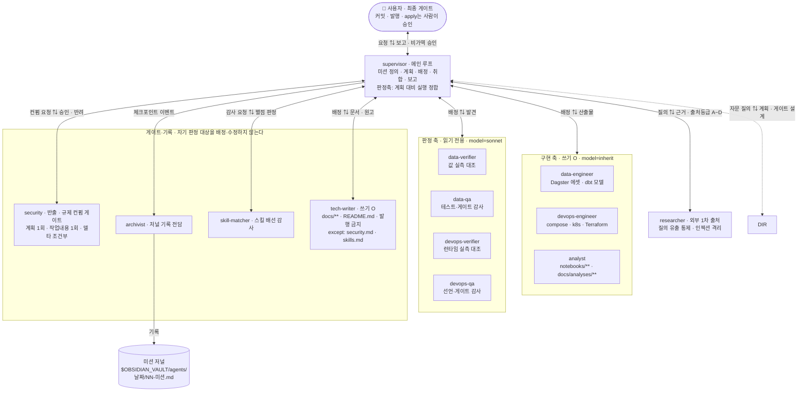
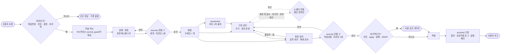

# PIPELINE STUDY

MIMIC-IV·eICU 중환자 데이터를 **Dagster + dbt + Iceberg 레이크하우스**로 적재·변환하고,
그 위에서 **SOFA → Sepsis-3 같은 임상 질문에 답하는** 학습·포트폴리오 프로젝트다.

**파이프라인은 수단, 분석이 목적**이다. 두 축이 다음처럼 나뉜다.

| 축 | 하는 일 | 규칙 정본 |
| --- | --- | --- |
| **파이프라인** | S3 → Iceberg 적재, dbt 실버 피처(22모델), 오케스트레이션 | [`conventions/dagster.md`](docs/conventions/dagster.md) · [`conventions/dbt.md`](docs/conventions/dbt.md) |
| **분석** | gold 지표·코호트, 노트북 탐색, 리포트 | [`conventions/analysis.md`](docs/conventions/analysis.md) |

> **현재 이행 중**: 단일 호스트 Docker Compose → **호스트 Dagster + 로컬 Kubernetes(컴퓨트·스토리지)**.
> 로드맵·단계별 게이트는 [`docs/redesign.md`](docs/redesign.md).

## 문서 (docs)

아키텍처와 코딩 규칙은 [`docs/`](docs/README.md)에 정리되어 있다.
이 프로젝트에서 정한 **규칙·결정·작업 패턴은 최대한 문서로 남기며**, `CLAUDE.md`·`docs/`·`README.md`를 함께 갱신해 단일 출처(single source of truth)를 유지한다.

- [코딩 철학](docs/philosophy.md)
- [재설계 로드맵](docs/redesign.md) — 이행 단계와 성공 게이트
- [전체 아키텍처 / 데이터 흐름](docs/architectures/overview.md)
- [리소스 산정](docs/resource-sizing.md)
- [분석 컨벤션](docs/conventions/analysis.md) — gold 모델 / 노트북 / 리포트 3층과 결론의 재현 경로
- [에이전트 오케스트레이션·기록관](docs/conventions/agents.md) — 서브에이전트 계층·권한·저널 규약 (아래 §AI 에이전트 구조)
- 코딩 규칙: [공통](docs/conventions/general.md) · [Python](docs/conventions/python.md) · [Dagster](docs/conventions/dagster.md) · [dbt](docs/conventions/dbt.md) · [Kubernetes](docs/conventions/k8s.md)

## 구성 요소

| 계층 | 현재 위치 | 비고 |
| --- | --- | --- |
| 오케스트레이션 | **호스트** — Dagster webserver·daemon | 메타 스토리지는 compose `postgres` |
| 배치 컴퓨트 | **K8s** — Apache Spark Operator → `SparkApplication` | 러너 이미지 `spark-runner:0.5.0`(Iceberg **1.11.0**·S3A·Spark Connect) |
| SQL 엔드포인트 | **K8s** — Spark Connect 서버 | dbt-spark가 `spark.remote`로 접속(Phase 1). 🔴 평시 `--replicas=0`이라 **쓰기 전에 1로 올린다**(§2-1) |
| 스트림 컴퓨트 | **K8s** — Flink Operator → `FlinkDeployment` | 오퍼레이터는 **기본 설치**(`INSTALL_FLINK=false`로 제외). 러너 이미지 `flink-runner:0.2.0`(Iceberg). 세션 클러스터는 **검증 후 내린다** |
| 테이블 포맷 | Iceberg (JDBC 카탈로그 = **CloudNativePG** `catalog-postgres`, 접속은 `-rw` 서비스) | Spark·Flink가 **동일 카탈로그 공유**(카탈로그명 `iceberg`로 통일) |
| 오브젝트 스토어 | SeaweedFS (S3 호환, path-style) | Iceberg 웨어하우스 |
| UI 진입점 | **K8s** — ingress-nginx (`*.localtest.me:8080`) | HTTP UI만 Ingress, 데이터 접속은 `port-forward`(§2-1) |
| 변환 | dbt — `dbt-trino`(현행) → `dbt-spark`(이행 중) | 모델 22개(`models/mimic_iv/`), 방언은 내장·dispatch 매크로로 흡수(`macros/cross_engine.sql`) |
| 분석 | **호스트** — Jupyter Lab(:8889) → Spark Connect / dbt gold 모델 | 탐색=`notebooks/`, 지표=gold(**현재 0개**), 결론=`docs/analyses/`(미생성). 규칙 [`conventions/analysis.md`](docs/conventions/analysis.md) |

## 실행방법

### 1. 환경변수

[`.env.example`](.env.example)을 `.env`로 복사해 값을 채운다(커밋 금지).
키가 컨테이너/호스트에서 갈리는 이유는 [`docs/operations.md`](docs/operations.md) §1-2 참고.

```shell
cp .env.example .env
```

### 2. 로컬 Kubernetes(컴퓨트·스토리지) 기동

**kind on Podman**(rootful 머신 필수) + 로컬 레지스트리 `localhost:5001`.
설정 단일 출처는 [`scripts/k8s-env.sh`](scripts/k8s-env.sh).

```shell
./scripts/k8s-up.sh                       # podman machine + kind 클러스터 + 레지스트리
./scripts/k8s-operators.sh                # Spark + Flink + CloudNativePG (Flink 제외는 INSTALL_FLINK=false)
./scripts/k8s-poc-storage.sh              # SeaweedFS + Iceberg 카탈로그 Postgres(CNPG Cluster)
./scripts/k8s-down.sh                     # 정리
```

> VM은 **8 CPU / 22888 MiB**(≈22.35 GiB)를 가져간다. 예산·배분과 **호스트 쪽 여유**는
> [`docs/resource-sizing.md`](docs/resource-sizing.md) — 🔴 호스트 32 GiB 기준으로 **실질 여유가 거의 없다.**

### 2-0. 컴퓨트 기동·회수 (검증 후 반드시 내린다)

상주 컴퓨트는 **켜둔 채 잊으면 예산을 계속 갉아먹는다**(과거 13시간 유출 전례 —
[`docs/conventions/k8s.md`](docs/conventions/k8s.md) §9-3). 쓰기 직전에 올리고 **끝난 자리에서 내린다.**

```shell
# Spark Connect (dbt·노트북용) — 평시 0, 쓸 때만 1
kubectl scale deploy/spark-connect --replicas=1
kubectl scale deploy/spark-connect --replicas=0     # 회수

# Flink 세션 클러스터 — 잡이 없어도 JM이 1 CPU/2Gi를 상주 점유한다
kubectl apply  -f k8s/flink/flinkdeployment-session.yaml
kubectl delete -f k8s/flink/flinkdeployment-session.yaml   # 회수
```

> 회수가 끝나면 상주는 **2250m(28%) / 3140Mi(14%)** 로 돌아온다(2026-08-22 실측, 분모는 노드 Allocatable).
> Spark·Flink **동시 기동은 허용**되며 실측 피크는 **84% / 52%** 다 — 단
> `spark.executor.instances` ≤ 1을 지킨다(2개면 97%).

### 2-1. Web UI 접근 (port-forward 불필요)

`k8s-up.sh`가 ingress-nginx까지 설치하므로 브라우저에서 바로 열린다.
(`localtest.me`는 공개 DNS가 127.0.0.1로 응답 — `/etc/hosts` 수정 불필요)

| URL | 대상 |
| --- | --- |
| http://flink.localtest.me:8080 | Flink Web UI (JobManager) — **세션 클러스터가 떠 있을 때만** 응답(§2-0) |
| http://spark.localtest.me:8080 | Spark Web UI (Connect 서버, 쿼리 이력 누적) — `--replicas=1`일 때만 |

**Spark Connect(gRPC)도 Ingress로 나간다** — `sc://spark-grpc.localtest.me:8443/;use_ssl=true`.
자체서명 CA를 클라이언트에 물려야 하며(`GRPC_DEFAULT_SSL_ROOTS_FILE_PATH`), 방법은
[`docs/conventions/k8s.md`](docs/conventions/k8s.md) §10 §gRPC. **카탈로그 Postgres·SeaweedFS는
여전히 `port-forward`** 를 쓴다(JDBC·S3는 HTTP/2가 아니라 이 경로로 못 낸다).

```shell
kubectl port-forward svc/catalog-postgres-rw 15432:5432   # Iceberg JDBC 카탈로그(CNPG 쓰기 서비스)
kubectl port-forward svc/seaweedfs           18333:8333   # S3 API
kubectl port-forward svc/spark-connect       15002:15002  # dbt(spark_connect 타깃)
```

> 🔴 **15002는 `spark-connect` 파드가 있어야 붙는다** — 평시 `--replicas=0`이므로 먼저 §2-0으로 1로 올린다.
> 내려간 상태에서는 `port-forward`가 실패하며, 이건 고장이 아니라 **회수된 상태**다.
>
> 🔴 **15432는 클라이언트 접속이 끝날 때마다 죽는다 — 호스트 부하 탓이 아니다.**
> 3/3 결정론적으로 재현되며 swap이 0일 때도 끊긴다(원인: Postgres 경로가 FIN이 아닌 **RST**로 끊고
> kubectl이 이를 터널 전체의 치명 오류로 취급). **같은 조건에서 15002·18333은 생존**한다.
> ⇒ **15432가 죽은 것을 "호스트 메모리 압박"의 근거로 삼지 마라**(그 지표는 무효다 —
> [`docs/resource-sizing.md`](docs/resource-sizing.md) §(D)). 자동 재기동하되 **시각을 남긴다.**
>
> ```shell
> until kubectl port-forward svc/catalog-postgres-rw 15432:5432; do
>     echo "$(date '+%F %T') 15432 재기동" >> /tmp/pf-15432.log
>     sleep 1
> done
> ```

### 2-2. 컴퓨트 러너 이미지 빌드 (최초 1회 / Dockerfile 변경 시)

Spark·Flink 워크로드는 Iceberg·S3A 의존을 구운 **전용 이미지**로 돈다. 로컬 레지스트리에 직접 push하면
클러스터가 같은 이름으로 받는다(`kind load` 불필요). 태그·매니페스트 갱신 규칙은
[`docs/conventions/k8s.md`](docs/conventions/k8s.md) §10.

```shell
podman build -f k8s/spark/Dockerfile.spark-runner -t localhost:5001/spark-runner:0.5.0 k8s/spark
podman push --tls-verify=false localhost:5001/spark-runner:0.5.0

podman build -f k8s/flink/Dockerfile.flink-runner -t localhost:5001/flink-runner:0.2.0 k8s/flink
podman push --tls-verify=false localhost:5001/flink-runner:0.2.0
```

> 태그를 올렸으면 이를 참조하는 매니페스트(`k8s/spark/*.yaml`·`k8s/flink/*.yaml`)도 **함께** 올린다.
> 한쪽만 올리면 구 이미지가 계속 돈다.

### 3. Dagster (호스트)

Dagster는 **클러스터 밖 호스트**에서 돌며 K8s를 원격 컴퓨트로 트리거한다
([`docs/conventions/k8s.md`](docs/conventions/k8s.md) §8).

```shell
podman compose up -d postgres             # 메타 스토리지만 기동 (127.0.0.1 바인딩)

cd dagster/dockerfile.d/src
export DAGSTER_HOME="$PWD"                # dagster.yaml이 있는 디렉터리
uv run dg dev                             # http://localhost:3000
```

> 🔴 **이 환경에는 `docker` 바이너리가 없다** — 컨테이너 런타임은 **podman 5.8.2**이고 compose는
> `podman compose`(외부 provider `docker-compose` v5.1.3 경유)로 돈다. 문서의 `docker compose ...`는
> 전부 `podman compose ...`로 읽는다.
>
> 컨테이너로 통째 띄우려면 `podman compose up -d --build`(webserver·daemon 분리 기동).
> 이 경우 Dagster가 클러스터를 트리거하는 경로는 별도 배선이 필요하다.
>
> **Dagster 실사용 RSS는 856.8 MiB**(8프로세스, 2026-08-22 실측)다 — VM이 22.35 GiB를 가져간 뒤
> 호스트 여유가 빠듯하므로 [`docs/resource-sizing.md`](docs/resource-sizing.md) §(D)를 함께 본다.

### 4. 노트북 (호스트, 옵션)

ad-hoc 탐색은 **Jupyter Lab**으로 한다. Dagster와 **같은 venv**를 쓰므로 커널 하나로
Spark Connect·pyiceberg에 붙고 `dagster_project.common.*`를 그대로 import할 수 있다.

```shell
kubectl scale deploy/spark-connect --replicas=1      # 평시 0이라 먼저 올린다 (§2-0)
kubectl port-forward svc/spark-connect 15002:15002   # 별도 터미널

cd dagster/dockerfile.d/src
uv run --group notebook jupyter lab --port 8889 --notebook-dir ../../../notebooks
```

> **8889를 쓰는 이유**: 기본 포트 8888은 compose SeaweedFS filer UI가 게시한다.
> 스타터 노트북·주의사항은 [`notebooks/README.md`](notebooks/README.md),
> **작성 규칙(재현성·정의 배치·수치 인용)** 은 [`docs/conventions/analysis.md`](docs/conventions/analysis.md).
> SQL 엔진은 **Spark SQL**이다 — Trino는 재설계에서 제거 대상이라 기본 기동에서 빠졌다.

### 5. 모델 추가

dbt 모델은 `dbt_pipelines/models/<dataset>/`에 `.sql`을 추가하면 자동 반영된다.
각 데이터셋 subproject가 **`@dbt_assets(select="fqn:<dataset>")`** 로 자기 모델만 소유한다
(`path:` 셀렉터는 cwd 글롭이라 정의 로드 시 모델이 수집되지 않는다 — [`docs/conventions/dbt.md`](docs/conventions/dbt.md)).

**접속 타깃은 `DBT_TARGET`으로 고른다** — `profiles.yml`이
`target: "{{ env_var('DBT_TARGET', 'spark_connect') }}"` 이므로 **기본값은 `spark_connect`** 다.

| 값 | 접속 대상 | 용도 |
| --- | --- | --- |
| *(미설정)* = `spark_connect` | K8s Spark Connect(:15002) | 평시 기본 |
| `DBT_TARGET=dev` | Trino | **값 대조**(엔진 간 결과 비교) |

```shell
kubectl scale deploy/spark-connect --replicas=1          # §2-0 — 먼저 올린다
kubectl port-forward svc/spark-connect 15002:15002       # 별도 터미널

dbt build                                                # spark_connect (기본)
DBT_TARGET=dev dbt build                                 # Trino로 값 대조
```

> 🔴 **같은 SQL이 엔진에 따라 값이 갈린 사례가 있다**(`dbt.datediff` — Spark는 경과시간 `ceil`,
> Trino는 경계 교차). 그래서 Trino 타깃은 제거 대상이면서도 **값 대조의 정본**으로 남아 있다.
> 수치를 문서·리포트에 옮길 때는 **산출 엔진을 병기**한다([`docs/conventions/dbt.md`](docs/conventions/dbt.md)).

## AI 에이전트 구조 (Claude Code)

이 저장소는 작업 자체도 규약화한다 — **전문 서브에이전트에 역할·권한을 나눠 배정**하고,
"누가 무엇을 왜 했는가"를 기록관 저널에 남긴다. 규칙 정본은
[`docs/conventions/agents.md`](docs/conventions/agents.md), 요약은 `CLAUDE.md` 운영 섹션에 있다.

> 🔴 **아래 두 그림은 축약본이다.** 워커 목록·권한·게이트의 **정본은
> [`docs/conventions/agents.md`](docs/conventions/agents.md) §구조도**이고, 갈리면 그쪽이 사실이다.

### 구조 — 누가 누구를 배정하는가



- 축(**구현 / 실측 대조 / 체계 감사**)은 도메인이 달라도 **동일**하다 — 판단 규칙을 하나로 유지하려는 것.
  분석·공개는 **새 축이 아니라 새 도메인**이라 구현 축 1명(`analyst`·`tech-writer`)만 두고 판정은 재사용한다.
- **판정자는 쓰지 않는다** — `disallowedTools: Write, Edit, NotebookEdit`으로 미부여(난이도)가 아니라 거부(강제).
  판정 축은 다섯이고 서로 중첩되지 않는다: 값=`*-verifier` / 체계=`*-qa` / 노출=`security` /
  배선=`skill-matcher` / 기록=`archivist`. **「계획 대비 실행 정합」은 supervisor가 직접 진다.**
- 🔴 **판정자는 자기 판정 대상을 배정·수정하지 않는다.** 2계층이라 배정 주체가 supervisor 하나뿐이어서
  이 원칙의 **강제는 도구 축**에 있다 — 판정자 6종의 쓰기 거부, `tech-writer`의 `except`(아래).
  **「계층 밖」은 `archivist`·`skill-matcher` 2종**이다(도메인 작업을 하지 않고 계층 자체를 감사·기록한다).
- **`tech-writer`는 저장소의 문서 소유자**다 — `docs/**`와 최상위 `README.md`를 쓴다. 🔴 단 가드는 디렉터리
  단위라 `docs/analyses/**`(내용은 `analyst` 소관)와 `docs/conventions/**`(규칙 신설은 supervisor 소관)는
  **규율로만** 갈린다. 🔴 **2026-08-22부터 `docs/conventions/**` 에는 `ask` 프롬프트도 없다**(정본 설계 게이트
  축소 — 판단 축을 **경로 → 가역성**으로 옮겼고, 문서 편집은 git이 되돌리므로 최종 관문을 **커밋 1회**로 모았다).
  ✅ 반대로 **`docs/security.md`·`docs/skills.md`는 규율에서 기계 강제로 올라갔다** — 이 워커를 **판정하는
  근거 문서**라, `worker_path_guard.py`의 **`except` 축**(`allow`/`deny`보다 먼저 평가·대소문자 무시)으로
  `deny`한다. 판정 대상이 판정 기준을 고치면 통제가 성립하지 않기 때문이고, **문안 정합조차 예외가 아니다**.
- **워커가 워커를 못 부르니 supervisor가 릴레이한다** — `skill-matcher`는 새 스킬 후보를 **직접 검색하지 않고**
  `researcher`에 보낼 **조사 요청서**를 반환한다(`skill-matcher`→supervisor→`researcher`→supervisor→채점·제안
  →`security`→🚦사람). 찾기는 `researcher`, 배선 판정은 `skill-matcher`, 출처 신뢰성은 `security`로 **셋이 갈린다** —
  🔴 **감사자가 배선까지 하면 자기가 배선한 것을 자기가 감사**하게 되어 이 워커의 존재 이유가 사라진다.
- 🔴 **2026-08-23에 3계층 → 2계층으로 바뀌었다.** 중간 계층 `director`를 폐기했다 — 3축 실측이 모두 같은
  방향이었다: ⓐ 정의 파일 17,430바이트인데 판정 축 문구가 정본 5~6곳 **중복** ⓑ 저널 65건 중 **실배정 1건**
  (91~97% 미경유) ⓒ `Agent` 호출 발행 시 `Agent is disabled for this session, in subagents as well as here`로
  **배정 불가 재현**(대조군: 같은 워커의 `Bash` 성공 · supervisor의 `Agent` 8회 성공).
  🔴 폐기 이유는 "안 돌아서"가 아니라 **유령 행위자**다 — 절차가 존재하지 않는 행위자를 지시하면
  *지켜지지 않는 것이 아니라 지킬 수 없고*, 실제로 그 때문에 **`security` 컨펌이 하루 0회**였던 기록이 있다.
  잃은 것은 **Δ 이탈 보고의 독립 주체** 하나이고, `security`가 G2에서 **변경 파일 집합을 직접 재구성**해
  대조하는 것으로 대체했다. 상세 [`agents.md` §director 폐기](docs/conventions/agents.md).

### 파이프라인 — 미션 한 건이 흐르는 경로



- **`security` 컨펌은 배정마다가 아니라 2점 + 델타다**(2026-08-20 개정) — ①**계획 전체** 1회
  ②**미션 전체 작업내용** 1회 Δ계획 밖(쓰기 경로·비가역·외부 발신) 발생 시 그 항목만. 배정 시점엔
  산출물이 없어 **읽기 전용 `security`가 볼 재료가 없기** 때문이고, 비용 절감이 목적이 아니다(호출 `2N+`→`2+Δ`).
  🔴 둘 다 **"한 벌"이 단위**다 — 워커별로 쪼개면 **파일 사이의 조합에서 생기는 노출**을 못 본다.
  🔴 **비가역은 Δ/①에서 실행 *전에* 판정**하며 ②로 미루지 않는다. 개정 효력은 3셀 대조 전까지 **`미확인`**이다.

**기계 강제층(hook)** — 위 흐름의 규율 중 일부만 실제로 강제된다. 결정값은 `allow`·`deny`·`ask`·`defer` 넷뿐이다.

| 가드 | 배선 | 막는 것 |
| --- | --- | --- |
| [`journal_guard.py`](scripts/journal_guard.py) | `SessionStart` · `PreToolUse(Write)` · `Stop` | 저널 `NN` 넘버링 경합 · 규약 위반 생성 · 기록 누락 경고 |
| [`session_sync_guard.py`](scripts/session_sync_guard.py) | `PreToolUse(Bash·Agent·Edit\|Write\|NotebookEdit)` | 병렬 세션의 중복 작업 · 워킹트리 전역 git 명령 |
| [`protected_paths_guard.py`](scripts/protected_paths_guard.py) | `PreToolUse(Bash)` | 보호 경로(`.env`·lock 등) 우회 수정 |
| [`worker_path_guard.py`](scripts/worker_path_guard.py) | `tech-writer`·`researcher`·`data-engineer`·`devops-engineer`·`archivist`·`data-extractor` 프론트매터 `hooks` | 워커별 쓰기 경로 이탈(`allow`/`deny`) + **`except`**(넓은 `allow` 안에 박힌 파일 단위 구멍 막이 — `tech-writer`의 `docs/security.md`·`docs/skills.md`. `allow`/`deny`보다 **먼저** 평가, 대소문자 무시) + **가드 스크립트 자기보호**(`*_guard.py`는 워커 무관 `deny`) (✅ `tech-writer` 3셀 대조로 실발동 확인 — 🔴 단 **뒤 3종은 2026-08-20 신규 배선분이라 `미확인`**, 새 세션 재대조 필요. 🔴 **`except` 축은 ✅ 라이브 실발동 확인 — 단 `Edit` 도구 한정**이고 `Write`·`NotebookEdit`은 미시도다. 근거는 *"막혔다"* 가 아니라 *"`allow` 분기와 **다른 분기 문구**로 막혔다"* 이며, 대조군이 **먼저** 통과해 관측 경로 생존을 확보했다. 정본 [`agents.md`](docs/conventions/agents.md) §`except` 축 대조) |
| [`analyst_path_guard.py`](scripts/analyst_path_guard.py) | `analyst` 프론트매터 `hooks` | 같은 목적 (✅ 실발동 확인 — 과거 미발동은 **`hooks`가 정의 로드 시점에 스냅샷**되기 때문) |

- 🔴 **`hooks`를 세션 도중 추가·수정하면 그 세션에는 반영되지 않는다** — 배선을 바꾸면 **새 세션에서** 3셀 대조를 다시 돌린다.
- 🔴 **경계표에 적혀 있다고 막히는 것이 아니다** — `worker_path_guard.py`의 `BOUNDARIES` 7종 중 3종(`data-engineer`·`devops-engineer`·`archivist`)은 2026-08-20까지 **프론트매터 `hooks`가 없어 한 번도 실행되지 않았다**(정의는 있고 호출자가 없던 상태). 강제되는 것은 **배선된 (가드 × 워커) 쌍**이다.
- 🔴 **`Bash` 경유 쓰기는 파일 가드를 우회**한다 — 그래서 "파일 수정을 `Bash`로 하라"는 지시는 거부한다.
- 🔴 **발행(업로드)은 어느 워커도 하지 않는다.** 외부 발신은 비가역이라 마지막 게이트는 **사람**이 갖는다
  (자동화하지 않는 것이 설계). 공개 기준은 [`docs/conventions/publishing.md`](docs/conventions/publishing.md).

## REF

규칙·설계가 근거로 삼는 외부 표준의 인덱스는 [`docs/references.md`](docs/references.md)에 있다.
아래는 이 저장소가 실제로 쓰는 스택의 1차 문서다.

### Dagster

- 배포 옵션(Kubernetes): https://docs.dagster.io/deployment/oss/deployment-options/kubernetes
- `dagster.yaml`(인스턴스 설정): https://docs.dagster.io/deployment/oss/dagster-yaml
- `workspace.yaml`(코드 로케이션): https://docs.dagster.io/guides/build/projects/workspaces/workspace-yaml
- Dagster Pipes / `PipesK8sClient`: https://docs.dagster.io/api/python-api/libraries/dagster-k8s

### dbt

- dbt-trino(현행): https://github.com/starburstdata/dbt-trino
- dbt-spark(이행 대상): https://docs.getdbt.com/docs/core/connect-data-platform/spark-setup
- 크로스 데이터베이스 매크로: https://docs.getdbt.com/reference/dbt-jinja-functions/cross-database-macros

### 레이크하우스 / 컴퓨트

- Apache Iceberg: https://iceberg.apache.org/docs/latest/
- Apache Spark Kubernetes Operator: https://apache.github.io/spark-kubernetes-operator/
- Apache Flink Kubernetes Operator: https://nightlies.apache.org/flink/flink-kubernetes-operator-docs-main/
- SeaweedFS(S3 API): https://github.com/seaweedfs/seaweedfs/wiki/Amazon-S3-API

### 로컬 K8s

- kind(Podman provider): https://kind.sigs.k8s.io/
- kind 로컬 레지스트리: https://kind.sigs.k8s.io/docs/user/local-registry/
- ingress-nginx: https://kubernetes.github.io/ingress-nginx/
