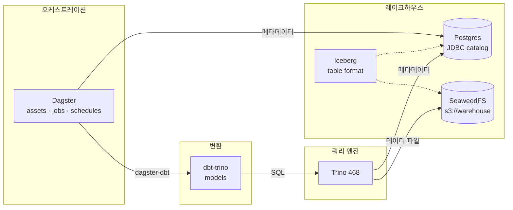
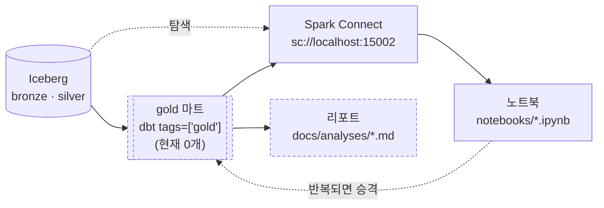
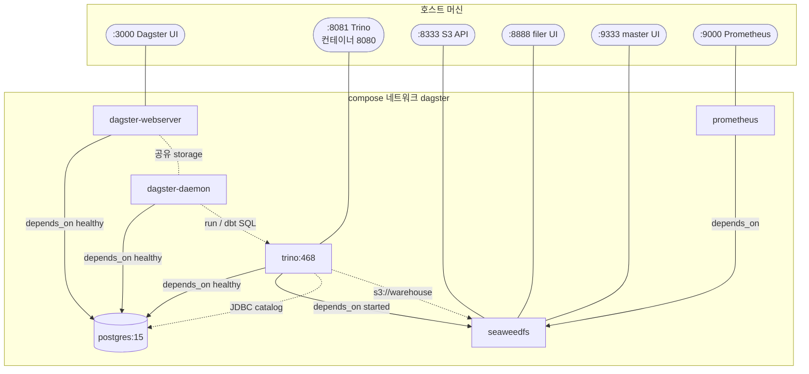
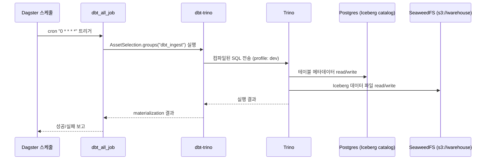
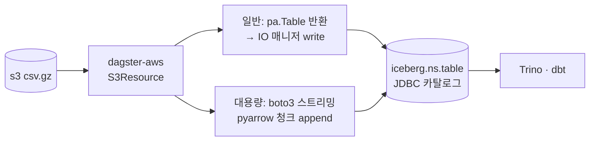

# 아키텍처 / 데이터 흐름

## 개요

`pipeline-study`는 **Dagster로 오케스트레이션하고, Iceberg 테이블 포맷을 SeaweedFS(S3 호환) 위에
적재하는** 로컬 레이크하우스 학습 프로젝트다.

> ⚠️ **이 문서의 compose 서술은 이제 대부분 폐기 전 판본이다.** 재설계로 컴퓨트·스토리지가
> **로컬 Kubernetes로 이전**했고 **Dagster도 2026-08-27 클러스터로 들어갔다**. 목표 토폴로지는
> [../redesign.md](../redesign.md), 클러스터 규칙은 [../conventions/k8s.md](../conventions/k8s.md),
> Dagster 배치 결정은 [dagster.md](dagster.md).
> **2026-08-27 기준 실제로 도는 구성**: kind 클러스터 하나 — Dagster(webserver·daemon) ·
> Spark Operator · SeaweedFS · 카탈로그/메타 Postgres(CNPG) · Flink Operator · ingress-nginx.
> **compose는 기본 `up`으로 아무것도 띄우지 않는다**(전부 profile opt-in이 됐다).
> **Flink Operator는 ⏸ 미설치**다 — 채택은 했으나 잡 없는 세션 클러스터가 상주 자원을 점유해
> 내렸고, `scripts/k8s-operators.sh`로 **오퍼레이터만** 복구한다(기본값이 `true`라 지정 없이 설치되며
> 제외는 `INSTALL_FLINK=false` — [`scripts/k8s-env.sh`](../../scripts/k8s-env.sh); 잡을 돌리려면 세션
> 클러스터를 따로 세운다 — [flink.md](flink.md)). trino와 같은 **"중단"과 "삭제"의 분리**다.
> 클러스터 UI는 `*.localtest.me:8080` 고정 URL, 데이터 접속은 `port-forward`
> ([../conventions/k8s.md](../conventions/k8s.md) §10).

## 구성 요소

**뼈대(core)는 profile이 없어 항상 뜨고, 나머지는 `--profile <name>`으로 opt-in**한다
(규칙 [../conventions/docker.md](../conventions/docker.md) §profiles).

| 서비스               | 이미지 / 위치              | profile                                      | 역할                                                                  |
| -------------------- | -------------------------- | -------------------------------------------- | --------------------------------------------------------------------- |
| `dagster-webserver`  | `dagster/dockerfile.d/`    | — (core)                                     | Dagster UI/GraphQL. `workspace.yaml`로 코드 로케이션 로드             |
| `dagster-daemon`     | `dagster/dockerfile.d/`    | — (core)                                     | 스케줄·센서·런큐 처리 + run 실행(`DefaultRunLauncher` 서브프로세스)   |
| `postgres`           | `postgres:15`              | — (core)                                     | ① Dagster 메타데이터 저장소 ② Iceberg **JDBC 카탈로그** 저장소        |
| `trino`              | `trinodb/trino:468`        | `legacy-sql`                                 | 분산 SQL 쿼리 엔진. dbt가 접속하는 대상 — **재설계로 제거 대상**      |
| `seaweedfs`          | `chrislusf/seaweedfs`      | `legacy-storage`·`legacy-sql`·`monitoring`   | S3 호환 오브젝트 스토리지. Iceberg 데이터 파일(`s3://warehouse`) 저장 |
| `prometheus`         | `prom/prometheus:v2.21.0`  | `monitoring`                                 | 메트릭 수집                                                           |

> 🔴 **의존받는 서비스는 의존하는 쪽의 profile을 전부 물려받는다** — `seaweedfs`에 profile이 3개인
> 이유다(`trino`=legacy-sql·`prometheus`=monitoring이 의존). 바꾼 뒤에는
> `docker compose --profile <p> config --services`로 profile별 구성을 확인한다.
> 스토리지 정본은 **K8s SeaweedFS**로 이전됐고 compose 쪽은 대피로로 남긴 것이다.

## 데이터 흐름



## 소비 계층 (분석) — 흐름의 종착지

위 흐름은 **저장까지**다. 이 저장소는 파이프라인이 목적이 아니라 **데이터셋별 질문에 답하기 위한 수단**이므로,
lineage는 소비에서 끝난다. 규칙 정본은 [`../conventions/analysis.md`](../conventions/analysis.md).



| 계층 | 위치 | 검증 |
| --- | --- | --- |
| **gold 마트** | `models/<dataset>/`(`tags=['gold']`) | dbt 스키마 테스트([`../test.md`](../test.md) §1) |
| **노트북** | `notebooks/` — 호스트 Jupyter Lab(:8889) | 실행 가능성([`../test.md`](../test.md) §6) |
| **리포트** | `docs/analyses/<NN>-<slug>.md` | 인용 수치의 재현 경로 |

- **SQL 엔진은 Spark Connect**다. 위 흐름도의 Trino는 compose 현행 구성이고, 재설계에서 제거 대상이라
  ad-hoc 조회는 Spark SQL로 간다([trino.md](trino.md) · [../redesign.md](../redesign.md) §5).
- **노트북 → gold 승격이 정방향**이다. 같은 조회가 3회 이상 반복되거나 리포트가 인용하면
  노트북에 두지 않고 모델로 올린다(Rule of Three).
- 점선 노드(gold·리포트)는 **아직 실물이 없다** — 규칙만 서 있고 첫 산출은 원천 데이터 적재
  이후다([../redesign.md](../redesign.md) Phase 5).

## 컨테이너 구성도 (compose)

`compose.yml`의 서비스 의존성과 포트 매핑.



> ⚠️ **이 구성도는 `compose.yml`에 정의된 전체**이고, 기본 `up`으로 뜨는 것은 **뼈대 3개**
> (`dagster-webserver`·`dagster-daemon`·`postgres`)뿐이다. `trino`(`legacy-sql`)·
> `seaweedfs`(`legacy-storage`·`legacy-sql`·`monitoring`)·`prometheus`(`monitoring`)는 **profile opt-in**이라
> 해당 profile을 켜야 위 포트가 열린다.
>
> `dagster-webserver`·`dagster-daemon`·`trino`는 `postgres` 헬스체크 통과 후 기동된다.
> webserver와 daemon은 같은 이미지·`dagster.yaml`을 쓰고
> **Postgres 공유 storage**로 상태를 협조한다. `trino`는 `seaweedfs`도 의존한다.

## Dagster 프로세스 분리 (webserver / daemon)

개발 편의용 일체형 `dg dev`(webserver+daemon+code 단일 프로세스) 대신, 운영 토폴로지로
**webserver와 daemon을 별도 컨테이너로 분리**한다.

| 프로세스             | entrypoint / command                          | 역할                                                       |
| -------------------- | --------------------------------------------- | ---------------------------------------------------------- |
| `dagster-webserver`  | `dagster-webserver -h 0.0.0.0 -p $PORT -w workspace.yaml` | UI/GraphQL 서빙(가벼움)                          |
| `dagster-daemon`     | `dagster-daemon run -w workspace.yaml`        | 스케줄·센서·런큐 디스패치 + run 서브프로세스 실행(무거움)   |

- **공유 storage 필수**: `dagster.yaml`의 run/event/schedule storage가 모두 **Postgres**라
  두 프로세스가 같은 상태를 보고 협조한다. `DagsterDaemonScheduler`+`QueuedRunCoordinator`는
  **daemon이 떠 있어야** 스케줄·큐가 처리된다.
- **run 실행 위치**: `DefaultRunLauncher`라 run은 **daemon 컨테이너에서 서브프로세스**로 돈다
  → daemon에 자원을 더 배정한다(compose `deploy.resources`).
- **코드 로케이션**: 독립 바이너리는 자동발견 대신 [`workspace.yaml`](../../dagster/dockerfile.d/src/workspace.yaml)
  (`python_module: dagster_project.definitions`)로 명시 로드한다.
- **manifest 사전생성**: webserver/daemon은 비-dev라 `DbtProject.prepare_if_dev()`가 no-op이므로,
  이미지 빌드(`Dockerfile`)에서 `dbt deps && dbt parse`로 `target/manifest.json`을 미리 만들어
  `@dbt_assets` 로드를 보장한다.
- (추후) 무중단 배포·코드 격리가 필요하면 독립 gRPC code-server(`dagster code-server start`)를
  더해 3-way로 승격할 수 있다.

## dbt 실행 시퀀스

스케줄(`dbt_all_schedule`, 매시 정각)이 잡을 트리거할 때의 흐름.



## 레이크하우스 상세

### Iceberg 카탈로그 (Trino)

`trino/etc/catalog/iceberg.properties`에서 정의한다.

- **카탈로그 타입**: JDBC (`iceberg.catalog.type=jdbc`)
- **카탈로그 저장소**: Postgres `iceberg_catalog` DB 재사용
- **데이터 웨어하우스 경로**: `s3://warehouse` (SeaweedFS)
- **파일시스템**: `fs.native-s3.enabled=true`, endpoint `http://seaweedfs:8333`, path-style 접근

> 비밀정보(액세스 키 등)는 properties에 직접 쓰지 않고 `${ENV:...}`로 치환한다.
> 카탈로그 디렉토리는 컨테이너에 **읽기전용(`:ro`)** 으로 마운트한다.

### dbt → Trino 접속 (profiles)

`dbt_pipelines/profiles.yml` (`type: trino`):

| target       | schema | threads | 비고                      |
| ------------ | ------ | ------- | ------------------------- |
| `dev` (기본) | `dev`  | 4       | 인증 없음(`method: none`) |
| `prod`       | `prod` | 8       | 인증 없음                 |

- `database: iceberg` → Trino 카탈로그명(= `iceberg.properties`의 `catalog-name`)과 일치해야 한다.
- `schema` → Trino 스키마. 없으면 dbt가 생성한다.

## bronze 적재 (S3 csv.gz → Iceberg)

이미 S3에 적재된 `csv.gz` 원본을 **메타스토어 없이** Iceberg(JDBC 카탈로그) 테이블로 올린다.
**공통 로직은 `dagster_project/common/`** 에 두고, **에셋은 데이터셋별 서브프로젝트**
(`defs/mimic_iv/`, `defs/eicu/`)에서 **각각 명시적으로 정의**한다(팩토리 미사용).

S3/Iceberg 연결은 **Dagster 리소스**(`dagster-aws`·`dagster-iceberg`)로 관리한다.

### 공통 모듈 (`dagster_project/common/`) — 데이터셋 무관, 재사용

| 파일            | 역할                                                                                          |
| --------------- | --------------------------------------------------------------------------------------------- |
| `constants.py`  | 카탈로그명·warehouse·S3 엔드포인트·기본값(chunk/namespace/group)                              |
| `helper.py`     | `read_csv_gz_table()`(일반: 통째 읽어 pa.Table) · `load_heavy_csv_gz_to_iceberg()`(대용량: 청크 append) |
| `dbt.py`        | 공유 `DbtProject`·`build_dbt_resource` (단일 dbt 프로젝트를 데이터셋 subproject가 공유) |

### 서브프로젝트 (`defs/<dataset>/`) — 데이터셋별, **정의만**(load_defs가 자동발견)

| 파일             | 역할                                                                          |
| ---------------- | ----------------------------------------------------------------------------- |
| `constants.py`   | 데이터셋 전용 `NAMESPACE`·`GROUP_NAME`·`SOURCE_BASE`                          |
| `assets.py`      | 테이블별 **명시적 `@dg.asset`**(bronze; 일반=IO 매니저 / 대용량=청크 append)   |
| `dbt_assets.py`  | 데이터셋 dbt 모델 소유 `@dbt_assets(select="fqn:<dataset>", project=dbt_project)` |

> 현재 `defs/mimic_iv/`(icu·hosp 11테이블 — 일반=IO 매니저, chartevents·labevents=대용량),
> `defs/eicu/`(3테이블 — patient·diagnosis=일반, nurse_charting=대용량).
> 공유 리소스는 `defs/resources.py`(`@dg.definitions`), 잡·스케줄은 `defs/automation.py`에 두고,
> 최상위 `definitions.py`의 `load_defs(dagster_project.defs)`가 모두 **단일 `Definitions`** 로 합친다.

### 두 가지 적재 경로

| 경로 | 조건 | 방법 | 자산 반환 |
| --- | --- | --- | --- |
| **A. 일반** | 부하 없는 CSV | `read_csv_gz_table` → **dagster-iceberg IO 매니저**가 자동 create+write | `pa.Table` |
| **B. 대용량** | 무거운 csv.gz(예: 3.3GB) | boto3 스트리밍 + **청크 append**(IO 매니저 미사용) | `MaterializeResult` |



### 핵심 설계

- **리소스로 관리**: S3는 `dagster-aws` `S3Resource`, Iceberg는 `dagster-iceberg`.
  연결 설정은 자산이 아니라 리소스에 둔다(관심사 분리).
- **메타스토어 불필요**: dagster-iceberg가 **동일한 Iceberg JDBC 카탈로그**를 재사용한다.
- **대용량 대응**: 3.3GB급 csv.gz는 IO 매니저(전량 메모리) 대신 `pyarrow` 청크 단위 `append`로 메모리 일정.
- **멱등성**: 대용량 경로 `mode="replace"`(기본)는 기존 테이블 제거 후 재적재.
- **에셋은 각각 명시적으로 정의**(팩토리/클래스 지양) — `CLAUDE.md` 컨벤션 준수.

### 사용법 (테이블 추가)

```python
# 일반 파일 — IO 매니저가 적재 (assets.py)
@dg.asset(group_name=GROUP_NAME, io_manager_key="io_manager_mimiciv", kinds={"python", "iceberg", "bronze"})
def admissions(s3: S3Resource) -> pa.Table:
    """MIMIC-IV hosp.admissions 적재."""
    return read_csv_gz_table(s3, f"{SOURCE_BASE}/hosp/admissions.csv.gz")
```

대용량(현재 `chartevents`·`labevents`·`nurse_charting`)은 `load_heavy_csv_gz_to_iceberg`를
호출하고, 대상 테이블용 `IcebergTableResource`를 `defs/resources.py`의 `resources`에 추가한다.

### 검증 상태

컨테이너 `dg check defs`로 **정의 로드 검증 통과**(`All definitions loaded successfully`).
- 빌드: python:3.13-slim에서 `dagster-iceberg==0.3.14`·`pyiceberg-0.11.1`·`pyarrow-24.0.0` 휠 정상 설치.
- ⚠️ **자산 모듈에서 `from __future__ import annotations` 금지** — Dagster가 `context`를
  클래스 identity로 검사하므로 문자열화되면 로드에 실패한다.
  상세 [`conventions/dagster.md`](../conventions/dagster.md).
- 대용량 스트리밍 적재 경로는 **실제 머티리얼라이즈로만 확인된다** —
  로드 검증(`dg check`)이 보는 층이 아니다.

## 실행 방법

🔴 **절차의 정본은 [`../setup.md`](../setup.md)** 다. 여기서는 순서만 요약하고
명령을 중복 정의하지 않는다(단일 출처 — [`../doc-sync.md`](../doc-sync.md)).

재설계 이후 기동은 **"전체 스택 `compose up`" 하나가 아니라 세 단계**이며 **compose는 등장하지 않는다**.

1. **`.env` 작성** — `.env.example` 복사([`../operations.md`](../operations.md) §1-2)
2. **로컬 K8s 기동**(컴퓨트·스토리지) — `scripts/k8s-up.sh` → `k8s-operators.sh` → `k8s-poc-storage.sh`
3. **Dagster 배포** — `scripts/k8s-dagster.sh` → http://dagster.localtest.me:8080

> 호스트 `uv run dg dev`(http://localhost:3000)는 **개발 루프 대안**으로 남는다 —
> 메타 DB·S3에 port-forward가 전제이고, **in-cluster와 동시에 띄우지 않는다**
> (같은 서비스의 이중 존재 — [../conventions/monitoring.md](../conventions/monitoring.md) §3-④).
> compose의 `dagster-*`·`postgres`·`trino`·`seaweedfs`·`prometheus`는 **전부 profile opt-in**이라
> 기본 `up`으로는 **아무것도 뜨지 않는다**(예: `podman compose --profile host-dagster up -d`).

dbt 모델 추가는 스캐폴딩이 필요 없다 — `models/<dataset>/`에 `.sql`을 넣으면 데이터셋 subproject의
`@dbt_assets(select="fqn:<dataset>")`가 자동 반영한다.

### 주요 포트 (compose)

| 포트 | 서비스                          | profile                                    |
| ---- | ------------------------------- | ------------------------------------------ |
| 3000 | Dagster UI (호스트 `dg dev` 전용) | `host-dagster` — **정본은 Ingress 8080**   |
| 8081 | Trino (컨테이너 8080 → 호스트 8081) | `legacy-sql`                           |
| 8333 | SeaweedFS S3 API                | `legacy-storage`·`legacy-sql`·`monitoring` |
| 8888 | SeaweedFS filer UI              | `legacy-storage`·`legacy-sql`·`monitoring` |
| 9333 | SeaweedFS master UI             | `legacy-storage`·`legacy-sql`·`monitoring` |
| 9000 | Prometheus (컨테이너 9090 매핑) | `monitoring`                               |

> 🔴 **호스트 8080은 kind ingress-nginx가 점유**한다(`k8s/kind-cluster.yaml`의 `extraPortMappings`).
> 그래서 Trino 게시 포트를 8081로 옮겼다 — 컨테이너 내부 포트는 8080 그대로라
> `dbt_pipelines/profiles.yml`(`host: trino`, `port: 8080`)은 영향받지 않는다([trino.md](trino.md)).
> 클러스터 UI(`*.localtest.me:8080`)와 노트북 Jupyter Lab(:8889)은 compose 밖이다.

## 참고

- Dagster — Docker 배포: https://docs.dagster.io/deployment/oss/deployment-options/docker
- Dagster — `dagster.yaml`: https://docs.dagster.io/deployment/oss/dagster-yaml
- dbt-trino: https://github.com/starburstdata/dbt-trino
- Trino — Iceberg connector: https://trino.io/docs/current/connector/iceberg.html
- Apache Iceberg: https://iceberg.apache.org/docs/latest/
- PyIceberg: https://py.iceberg.apache.org/
- SeaweedFS: https://github.com/seaweedfs/seaweedfs
