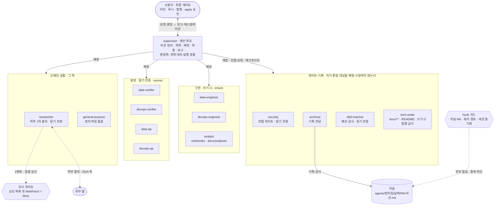

# 에이전트 오케스트레이션 규약 (agents)

> 역할 개념은 Claude Code와 Codex가 공유하지만, 이 문서의 프론트매터·도구명·hook
> 실측은 Claude Code 기준이다. Codex의 별도 설정과 런타임 차이는
> [`codex.md`](codex.md)를 따른다.

AI 세션의 작업을 **2계층(supervisor → worker)** 으로 나누고, "누가 무엇을 왜 했는가"를
**기록관 저널**에 남기는 규약이다. 이 문서가 **인덱스**이고 규칙은 아래 문서들이 갖는다.
요약은 [`CLAUDE.md`](../../CLAUDE.md) 운영 섹션에 있다.

> 원칙: **단순함(YAGNI)** — 계층·워커는 필요할 때만 늘린다.
> **추적 용이성** — 결정과 근거를 남겨 나중에 grep/점프 가능하게 한다.
> **있었던 일만 기록** — 하지 않은 활동은 남기지 않는다.

## 문서 지도

| 문서 | 담는 것 |
| --- | --- |
| [`agents/workers.md`](agents/workers.md) | 워커 편성(도메인 × 축) · 경계 · 외부 접촉 4축 · 네이티브 구현 |
| [`agents/permissions.md`](agents/permissions.md) | 권한 매트릭스 · 프론트매터 · 통제 5층 · 경로 경계 |
| [`agents/enforcement.md`](agents/enforcement.md) | 가드 배선 · hook 이벤트 · **실발동 확인 절차** |
| [`agents/gates.md`](agents/gates.md) | 승인 게이트 · `security` 컨펌(G1·G2·Δ) · 조사 프로토콜 · 에스컬레이션 |
| [`agents/journal.md`](agents/journal.md) | 저널 저장 위치 · 포맷 · 기록 주체 · 기록 시점 |
| [`agents/plan-mirror.md`](agents/plan-mirror.md) | 계획서 볼트 미러 · opt-out 규칙 |
| [`agents/parallel.md`](agents/parallel.md) | 병렬 세션 가드 · hook 결정값 · 세션 지목 |
| [`agents/peer.md`](agents/peer.md) | 세션 간 협업 규율 · 제안 처리 · 비대기 협상 |

## 구조도

🔴 **화살표가 supervisor에서만 나간다 — 그런데 이건 하네스가 아니라 정책이 만드는 그림이다.**
하네스는 서브에이전트에 `Agent`를 **기본 지급**하고 **3계층까지 허용**한다.
이 화살표를 유지하는 것은 **`tools:` 전원 명시**이고, 한 워커라도 미지정이면 조용히 열린다.

## 역할 계층

| 계층 | 실체 | 책임 | 하지 않는 것 |
| --- | --- | --- | --- |
| **supervisor** | 메인 루프 | 목표·성공조건 정의 → 분해·계획 → 권한 매니페스트 → G1 → 배정·조율 → 승인 게이트 → **계획 대비 실행 정합** 판정 → G2 → 취합·보고 | 직접 실행작업 · **자기 판정 대상의 수정** |
| **worker** | `Agent` 툴 서브에이전트 | 배정받은 **단일 작업**을 승인 아래 수행하고 결과를 반환 | 다른 워커 배정 · 무승인 실행 |
| **security**(게이트) | 읽기 전용 워커 | supervisor 결정의 **최종 컨펌** — 노출·규제·거버넌스 판정 | 직접 수정·실행 |
| **archivist**(계층 밖) | 워커 | **모든 결정·액션의 기록 주체** — 저널·MOC 유지 | 판단·실행 |
| **skill-matcher**(계층 밖) | 읽기 전용 워커 | **스킬↔워커 배선 감사** — 채점·드리프트 판정, 조사 요청서 설계 | 설치·lock 편집·배선 · 직접 웹 검색 |

- **「계층 밖」은 `archivist`·`skill-matcher` 2종**이다 — 도메인 작업을 하지 않고
  **계층 자체를 감사·기록**한다. `security`는 게이트지만 도메인 산출물을 다루므로 계층 밖이 아니다.
- 🔴 **판정자는 자기 판정 대상을 배정·수정하지 않는다.** 배정 주체가 supervisor 하나뿐이라
  "누가 배정하는가"로는 이 원칙을 표현할 수 없다 — **강제는 도구 축**에 있다
  ([`agents/permissions.md`](agents/permissions.md)).
- 규모가 작은 미션은 워커 없이 supervisor가 직접 수행해도 된다(YAGNI).
  이때 저널에는 워커를 **"미배정"** 으로 남긴다(가상 활동 금지).

## 설계 게이트 — 분해 전에 답해야 하는 3문항

**받은 목표를 곧바로 하위작업으로 쪼개지 마라.** 분해는 이미 "무엇을 만들지 정해졌다"고 전제하는
행위다. 그 전제가 틀리면 **정확하게 잘못된 것을 효율적으로 만든다** — 배정이 깔끔할수록 되돌리기 비싸다.

1. **무엇을** — 바꾸려는 것을 한 문장으로 말할 수 있는가(산출물 형태까지)
2. **왜 지금** — 반복 실적이 있는가(Rule of Three), 아니면 한 번의 불편인가
3. **성공을 어떻게 아는가** — 무엇을 관측하면 "됐다"이고, 그 관측 경로는 살아 있는가

🔴 **하나라도 못 답하면 분해하지 말고 사용자에게 `[질의]`한다.** 추측으로 채운 전제는
계획서 안에서 사실처럼 굳고, 그 뒤로는 아무도 다시 묻지 않는다.
질의에는 **선택지와 권고안**을 함께 낸다 — 질문만 던지고 멈추는 것은 교착이다.

뒷받침 장치가 둘 있으나(`permissions.defaultMode: "plan"` · 경로 가드)
**둘 다 auto 모드에서 `ask`가 흡수될 수 있다.** 문구가 안 뜨는 경우에도 3문항은 **스스로** 답해야 한다.
**게이트가 조용한 것을 승인으로 읽지 마라.**

## 참고

- 타임존 정책: [`timezone.md`](timezone.md) · 문서 동기화: [`../doc-sync.md`](../doc-sync.md)
- Claude Code Hooks: <https://code.claude.com/docs/en/hooks>
- 사용자 정의 subagent(프론트매터 정본): <https://code.claude.com/docs/ko/sub-agents>
